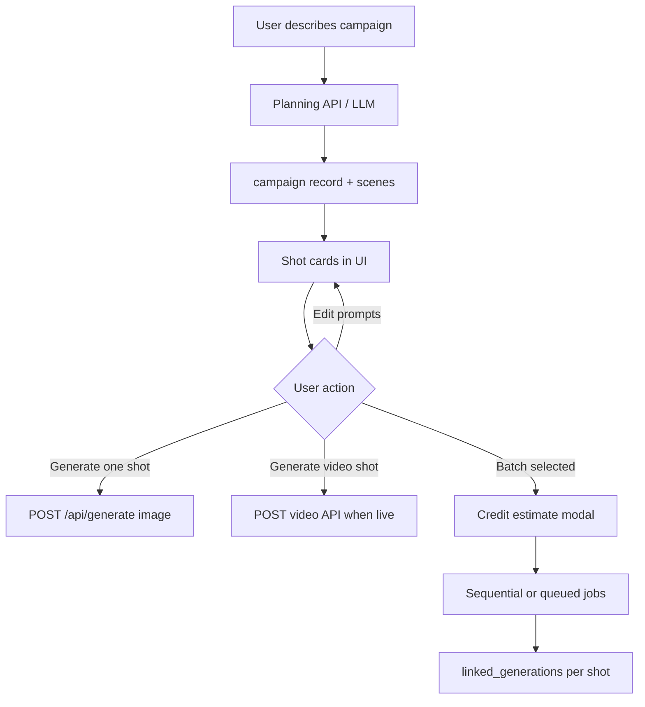

# InfluExAi — Cinema Agent Implementation Plan

**Document type:** Technical implementation specification  
**Audience:** Engineering, product, operations  
**Status:** **Planning Beta (client preview live)** — no provider API, no credits, no batch generation  
**Last updated:** 2026-05-22  
**Related:** [CREDIT_AND_MODE_STRATEGY.md](./CREDIT_AND_MODE_STRATEGY.md), [ROADMAP_IMAGE_VIDEO_MODES.md](./ROADMAP_IMAGE_VIDEO_MODES.md), [VIDEO_STUDIO_IMPLEMENTATION_PLAN.md](./VIDEO_STUDIO_IMPLEMENTATION_PLAN.md)

This specification describes **Cinema Agent** as a **planning and orchestration layer** above image and video generation—not a single media provider.

### Planning preview (shipped in dashboard)

| Item | Detail |
|------|--------|
| **UI** | `app/dashboard/CampaignPlanner.tsx` — client-side rule-based plan |
| **Navigation** | Dashboard → **Campaign Planner** (Cinema Agent · Planning Beta) |
| **Credits** | **0** — no `consume_user_credits`, no API routes |
| **Provider** | **None** — no OpenAI, no fal, no worker changes |
| **Outputs** | Campaign angle, content set, shot list (5+ cards), captions, hashtags |
| **Handoff** | **Use in AI Agent** on each shot card → loads `suggestedImagePrompt` into the AI Agent prompt field via `regenerateDraft` (no `/api/generate`, no credits). **Copy prompt** copies text only. |
| **Generation** | **Manual only** — user picks mode/format in AI Agent and submits. No auto-start. |
| **Not included** | Auto batch generation, Omni orchestration API, social posting |
| **Future** | Batch generation with per-shot credit estimate and explicit confirm before `/api/generate` |

**Omni Campaign Agent** remains a separate roadmap module; full cross-channel orchestration is not in this preview.

---

## 1. Goal

Cinema Agent shall later turn a **campaign idea** into a structured **visual production plan**: scenes, shot lists, prompts, and optional video briefs—then let users generate selected assets with explicit credit confirmation.

| Objective | Detail |
|-----------|--------|
| Primary value | Pre-production structure before expensive generation |
| Outputs | Campaign plan, shot cards, exportable prompt set |
| Generation | Delegates to existing Standard/Premium image and Video Studio (manual) |
| MVP preview | **Campaign Planner** — planning only, no API activation |

---

## 2. Core concept

```
User prompt (campaign brief)
    → campaign concept (angle, audience, tone)
    → visual direction (style, palette, mood)
    → scene list (ordered beats)
    → shot descriptions (per scene)
    → image prompts (per shot)
    → video prompts (per shot, optional)
    → caption / hook ideas
    → user selects shots to generate
    → (later) batch execution with credit estimate
```

Cinema Agent is **orchestration + LLM planning**, not a replacement for OpenAI image or video providers.

---

## 3. Use cases

| Use case | Output |
|----------|--------|
| Campaign storyboard | Multi-shot plan before any render |
| YouTube thumbnail + scene variations | Thumbnail shot + supporting stills |
| Product launch visual sequence | Ordered product/creator shots |
| Creator ad storyboard | UGC-style shot list |
| Video pre-production | Video prompts for Video Studio (when live) |
| Batch generation planning | Queue N shots with total credit preview |

---

## 4. Future flow



### Planning phase (low cost)

1. User submits campaign brief in Cinema Agent UI.
2. Backend runs **text-only** planning (LLM)—no image/video provider call.
3. Persist `campaigns`, `campaign_scenes`, `scene_prompts`.
4. Return structured JSON for UI shot cards.

### Generation phase (charged)

1. User clicks **Generate** on one or more shots.
2. UI shows **estimated credits** (sum of image + video tiers per shot).
3. User confirms → existing image API and/or future video API per shot type.
4. Link each `generations` row to `campaign_scenes` via `linked_generations`.

**No automatic expensive provider calls without confirmation** ([CREDIT_AND_MODE_STRATEGY.md](./CREDIT_AND_MODE_STRATEGY.md) §9).

---

## 5. Required future components

| Component | Purpose |
|-----------|---------|
| **Campaign planner UI** | Brief input, campaign title, status |
| **Shot cards** | Scene number, description, prompt preview, asset status |
| **Prompt variants** | A/B prompt lines per shot (optional) |
| **Asset status** | `planned` \| `generating` \| `completed` \| `failed` |
| **Generate selected shot** | Single-shot → Standard/Premium image today |
| **Export campaign plan** | PDF/JSON/clipboard for client handoff |
| **Batch generation** (later) | Multi-select + queue with total credit estimate |

---

## 6. Future database considerations

New tables (proposed — migrate when implementing):

| Table / entity | Purpose |
|----------------|---------|
| `campaigns` | User, title, brief, status, created_at |
| `campaign_scenes` | Ordered scenes under a campaign |
| `scene_prompts` | `image_prompt`, `video_prompt`, captions per scene |
| `linked_generations` | `scene_id` ↔ `generation_id` (and later video job id) |
| `status` | Campaign and per-scene state |
| `selected_assets` | Which shots user marked for export or batch |

Reuse existing `generations` for actual pixels; Cinema tables hold **planning metadata only**.

---

## 7. Credit model

| Activity | Credits |
|----------|---------|
| **Planning (text-only)** | **Free or low-cost** (e.g. 0–1 credit per campaign plan — TBD) |
| **Image generation per shot** | Standard **1 credit** (or Premium **2–3**) — existing rules |
| **Video generation per shot** | Video Studio tiers **15–80** when live |
| **Batch generation** | Sum of selected shots; **estimate shown before execution** |

Cinema Agent must **not** bundle hidden video charges into planning. Line-item estimate per shot type.

---

## 8. Safety requirements

| Rule | Requirement |
|------|-------------|
| No auto expensive calls | User confirms each shot or batch |
| Credit estimate before batch | Modal with breakdown by shot |
| Selectable shots | User can generate subset only |
| Standard Image fallback | Per-shot image always available via `standard` workflow |
| Planning failure | No charge if LLM planning fails |
| Idempotent batch | No duplicate jobs for same `scene_id` |
| MVP | **No API activation** — roadmap UI only |

---

## 9. UI requirements later

| Requirement | Detail |
|-------------|--------|
| Cinema Agent | **Disabled / Planned** until planning backend exists |
| MVP | **Roadmap card only** in sidebar/landing — Coming soon badge |
| No provider Live label | Planning is not a “FLUX Live” feature |
| Shot card actions | Generate / Edit prompt / Mark selected |
| Credit preview | On single-shot and batch actions |
| Link to Gallery | Completed shots appear via `linked_generations` |

**Do not** wire Cinema UI to `/api/generate` until planning schema and confirmation flows exist.

---

## 10. Rollout plan

| Step | Scope | Deliverable |
|------|--------|-------------|
| **1** | Documentation only | This file (**current step**) |
| **2** | Text-only planning prototype | Campaign + scenes in DB; no media providers |
| **3** | Shot-to-image generation | One shot → Standard Image API |
| **4** | Batch generation | Multi-shot queue + credit estimate |
| **5** | Video integration | Video prompts → Video Studio when live |

**Relationship to Omni Campaign Agent:** Cinema focuses on **shot planning and selective generation**; Omni (Phase 8) may orchestrate cross-channel campaigns later. Cinema can ship earlier as planning-only.

**Not Live in MVP** — no user-facing “Live” status for Cinema Agent module.

---

## 11. API changes needed later (reference only)

| Route (proposed) | Purpose |
|------------------|---------|
| `POST /api/cinema/plan` | Text-only campaign structure |
| `GET /api/cinema/campaigns/:id` | Scenes + prompts |
| `POST /api/cinema/scenes/:id/generate` | Confirmed single-shot → delegate to image API |
| `POST /api/cinema/campaigns/:id/batch` | Confirmed multi-shot with credit check |

Do not modify `app/api/generate` behavior in documentation-only phase.

---

## 12. Out of scope for Cinema v1

- Automatic full-campaign video render without per-shot confirm
- Lip Sync integration
- Live MVP module
- Replacing AI Agent for simple single prompts

---

## Document maintenance

- Align with Omni Campaign Agent roadmap when defined.
- Update planning credit cost if LLM COGS significant.

**Owner:** Platform engineering
