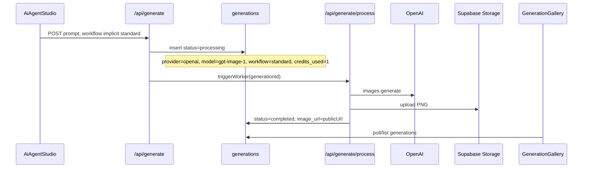
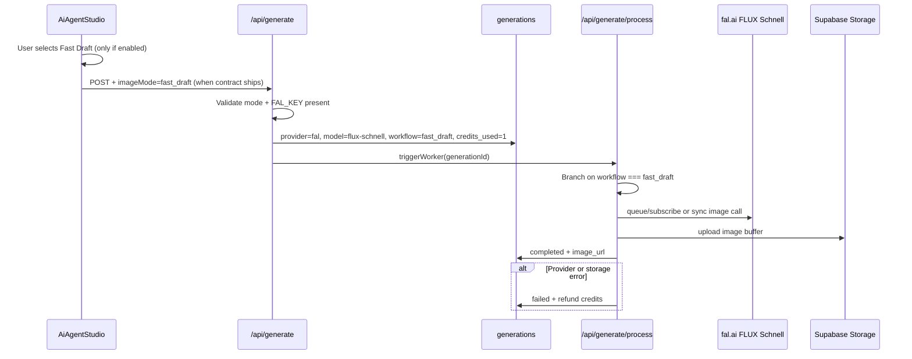

# InfluExAi — Fast Draft Mode Implementation Plan

**Document type:** Technical implementation specification  
**Audience:** Engineering, product, operations  
**Status:** Planning only — **no provider activated**, **no code changes authorized by this document**  
**Last updated:** 2026-05-22  
**Related:** [CREDIT_AND_MODE_STRATEGY.md](./CREDIT_AND_MODE_STRATEGY.md), [ROADMAP_IMAGE_VIDEO_MODES.md](./ROADMAP_IMAGE_VIDEO_MODES.md), [ENVIRONMENT_VARIABLES.md](./ENVIRONMENT_VARIABLES.md)

This specification describes how **Fast Draft** (FLUX Schnell via fal.ai) should be integrated alongside **Standard Image** (OpenAI `gpt-image-1`). It does not enable Fast Draft in production.

---

## 1. Goal

Fast Draft Mode shall exist as an **optional**, cheaper/faster image path **next to** Standard Image—not as a replacement.

| Objective | Detail |
|-----------|--------|
| User value | Rapid visual exploration, drafts before final Standard renders |
| Credit parity (initial) | 1 credit per image (same as Standard; revisit if COGS differ) |
| Non-regression | Standard Image remains default, fallback, and fully supported |
| Activation | UI and API stay disabled for Fast Draft until backend, cost control, and tests pass |

---

## 2. Provider candidate

| Field | Value |
|-------|--------|
| **Product name** | Fast Draft |
| **Model family** | FLUX Schnell |
| **Integration host (proposed)** | fal.ai (`@fal-ai/client` — already used elsewhere for character training) |
| **Proposed `provider` value** | `fal` |
| **Proposed `model` value** | `flux-schnell` (exact fal model id TBD at implementation, e.g. `fal-ai/flux/schnell`) |
| **Status** | **Candidate** — not active |
| **Env var (existing pattern)** | `FAL_KEY` (see [ENVIRONMENT_VARIABLES.md](./ENVIRONMENT_VARIABLES.md); today tied to disabled character training) |

### Activation gates (must all pass before Live)

- Backend routing for `workflow` / mode `fast_draft`
- Credit debit = 1 (or revised after COGS sign-off)
- Refund on failure (same RPC path as Standard)
- Storage upload + gallery URL
- Worker timeout and idempotency
- Production end-to-end test
- **No UI activation** without backend + cost control ([CREDIT_AND_MODE_STRATEGY.md](./CREDIT_AND_MODE_STRATEGY.md) §11)

Do not expose fal/FLUX branding in user-facing copy until the mode is Live; marketing label: **Fast Draft**.

---

## 3. Current Standard flow (baseline)

Today only Standard Image is processed end-to-end.



### Observed behavior (MVP today)

| Step | Behavior |
|------|----------|
| **Submit** | `POST /api/generate` — consumes credits via `consume_user_credits`, inserts `generations` row |
| **Row fields** | `workflow: "standard"`, `provider: "openai"`, `model: "gpt-image-1"`, `credits_used: 1` |
| **Format** | `image_size`, `output_width`, `output_height`, `social_platform`, `output_format` from output format selector |
| **Worker** | `POST /api/generate/process` — auth via `GENERATION_WORKER_SECRET` |
| **Guard** | Non-`standard` / non-`openai` jobs → `markFailedAndRefund` with MVP disabled message |
| **Success** | OpenAI image → buffer → `generations` bucket → `image_url` set, `status: completed` |
| **Failure** | `status: failed`, `refund_user_credits`, `credits_used: 0` on row |

**Reference paths (do not modify in Step 1 — documentation only):**

- `app/api/generate/route.ts` — job creation, credit consume, insert
- `app/api/generate/process/route.ts` — worker, OpenAI path, refund helpers

---

## 4. Future Fast Draft flow (target)

When implemented behind a feature flag, the flow mirrors Standard with a different provider branch.



### Target row shape (proposed)

| Column | Fast Draft value |
|--------|------------------|
| `workflow` | `fast_draft` |
| `provider` | `fal` |
| `model` | `flux-schnell` (or exact fal endpoint id) |
| `credits_used` | `1` |
| `status` | `processing` → `completed` \| `failed` |
| `image_url` | Public Supabase URL after upload |
| `final_prompt` | Same Creative Prompt Engine output as Standard (shared brief) |

### Worker routing (proposed)

```
if workflow === "standard" && provider === "openai":
  → processOpenAIImage()   // unchanged
else if workflow === "fast_draft" && provider === "fal":
  → processFastDraftImage()  // new; isolated module
else:
  → markFailedAndRefund()    // unknown mode
```

Remove or narrow the current MVP guard that refunds **all** non-standard rows once Fast Draft is intentionally enabled.

### fal.ai integration notes (implementation time)

- Reuse `@fal-ai/client` pattern from `app/api/characters/training-status/route.ts` (queue status/result).
- Choose sync vs queue API based on latency SLA (target: noticeably faster than Standard; define timeout, e.g. 90–120s).
- Map `image_size` / aspect to fal input parameters (may differ from OpenAI `1024x1024` enums).
- Download result URL or binary → same `uploadImageBuffer` helper as Standard.
- Log fal request id internally; optional persist as `provider_job_id` when column exists.

---

## 5. Database requirements

### Existing columns (sufficient for Fast Draft v1)

These fields already exist on `generations` and are enough for a first Fast Draft ship **without migration**:

| Column | Fast Draft usage |
|--------|------------------|
| `provider` | `fal` |
| `model` | `flux-schnell` |
| `workflow` | `fast_draft` |
| `credits_used` | `1` |
| `image_size` | Aspect/size hint for provider |
| `output_width` / `output_height` | Gallery/layout metadata |
| `image_url` | Set on success |
| `status`, `error_message`, `failed_at` | Failure path |
| `final_prompt`, `prompt` | Generation input |

No schema change required for MVP Fast Draft if `workflow` discriminates the worker branch.

### Optional later columns

| Column | Purpose |
|--------|---------|
| `mode` | Mirror UI `imageMode` if `workflow` naming diverges |
| `provider_job_id` | fal queue id for support/debug |
| `provider_latency_ms` | Cost/performance monitoring |
| `credit_cost` | Audit if price differs from `credits_used` |

See [ROADMAP_IMAGE_VIDEO_MODES.md](./ROADMAP_IMAGE_VIDEO_MODES.md) §7 for migration checklist when adding fields.

---

## 6. API changes needed later

**Do not implement until Step 2+ of rollout.** Files listed for planning reference only.

### `app/api/generate/route.ts`

| Change | Detail |
|--------|--------|
| Accept `imageMode` | Only when `FAST_DRAFT_ENABLED` (or equivalent) is true server-side |
| Validation | Reject `fast_draft` if `FAL_KEY` missing or flag off |
| Mapping | `fast_draft` → `provider: fal`, `model: flux-schnell`, `workflow: fast_draft` |
| Credits | `credits_used: 1` (constant shared with Standard until pricing changes) |
| Fallback | Unknown or disabled mode → force `standard` / 400 with clear error |
| Worker trigger | Unchanged `triggerWorker(generationId)` |
| Transaction `source` | New suffix e.g. `fast_draft_generation_job` for analytics |

### `app/api/generate/process/route.ts`

| Change | Detail |
|--------|--------|
| Branch | Add `processFastDraftImage()`; **do not modify** OpenAI logic inside `processOpenAIImage` |
| Guard | Replace blanket “non-standard disabled” with explicit allowlist: `standard`, `fast_draft` |
| Timeout | Abort fal call + `markFailedAndRefund` on timeout |
| Idempotency | Keep `status !== processing` → skip (no duplicate processing) |
| Env | Fail fast if `FAL_KEY` unset when processing `fast_draft` |

### Cron / queue (unchanged contract)

- `/api/cron/process-generations` and `/api/generate/process-next` should continue to dequeue `processing` rows regardless of workflow once branch exists.

---

## 7. UI changes needed later

**Current state:** `AiAgentStudio.tsx` defines `fast_draft` in Image Mode UI but locks selection to `standard` via `useEffect`. Submit does not send `imageMode` to `/api/generate`.

### `app/dashboard/AiAgentStudio.tsx`

| Change | Detail |
|--------|--------|
| Enable Fast Draft card | Only when public config or feature flag confirms backend Live |
| Credit label | Show **1 credit** on card (i18n EN/DE) |
| UX copy | “Faster draft” — set expectations vs Standard quality |
| Submit payload | Add `imageMode: "fast_draft"` only when enabled |
| Default | Remain `standard` on load and after errors |

### `app/dashboard/CreditsCard.tsx` (optional)

- One-line note: Fast Draft uses 1 credit per image (same as Standard) if users need clarity.

### Gallery / badges

- Display workflow/mode badge: **Fast Draft** vs **Standard** (internal metadata; no fal trademark in UI).

---

## 8. Safety rules

| Rule | Requirement |
|------|-------------|
| Standard fallback | API and UI default to Standard; Fast Draft opt-in only |
| Refund on failure | Use existing `refund_user_credits` + `markFailedAndRefund` |
| No duplicate processing | Respect `status === processing` skip; single worker invocation per job |
| Timeout | Configurable max duration; failed + refund, never stuck `processing` |
| Env validation | `FAL_KEY` required before accepting or processing `fast_draft` |
| Production test | Full path on Vercel before any user-facing enable |
| Provider unavailable | Do not expose Fast Draft in UI; API returns 503/400 with safe message |
| Cost monitoring | Track fal spend per job; alert if COGS &gt; credit revenue |
| No silent activation | Feature flag default **off** in production until Step 5 |

Aligned with [CREDIT_AND_MODE_STRATEGY.md](./CREDIT_AND_MODE_STRATEGY.md) §9.

---

## 9. Test plan

Use before enabling UI for users. Extend [PRODUCTION_QA.md](./PRODUCTION_QA.md) when Fast Draft goes Live.

### Functional

| # | Test | Expected |
|---|------|----------|
| 1 | Local generation (flag on) | `completed`, valid `image_url` |
| 2 | Production generation (Vercel) | Same; worker secret auth works |
| 3 | Credits deducted | Balance −1 on submit |
| 4 | Failure refund | Force fal error → `failed`, balance restored |
| 5 | `image_url` stored | Public URL loads in browser |
| 6 | Gallery list/detail | Thumbnail and detail page render |
| 7 | Regenerate / delete / favorite | Unchanged behavior |
| 8 | Standard regression | Standard job still OpenAI, 1 credit, no fal call |

### Environment & reliability

| # | Test | Expected |
|---|------|----------|
| 9 | `FAL_KEY` present on Vercel | Fast Draft jobs process |
| 10 | `FAL_KEY` missing | API rejects `fast_draft`; UI hidden or disabled |
| 11 | Provider outage | Failed status + refund; no infinite processing |
| 12 | Duplicate worker POST | Second call skipped or no double charge |
| 13 | Mobile Agent UI | Mode selector and result layout acceptable |
| 14 | EN/DE copy | Fast Draft strings reviewed |

### Observability

- Log generation id, workflow, provider, duration (no secrets).
- Sample COGS per 100 Fast Draft jobs before removing internal-only gate.

---

## 10. Rollout plan

| Step | Scope | Deliverable |
|------|--------|-------------|
| **1** | Documentation only | This file + strategy/roadmap cross-links (**current step**) |
| **2** | Backend behind disabled flag | API + worker branch; `FAST_DRAFT_ENABLED=false` in prod |
| **3** | Manual QA | Checklist §9 green in staging/preview |
| **4** | Internal/admin only | Flag on for allowlisted users; UI gated |
| **5** | General availability | Enable Fast Draft card; monitor credits and fal bills |
| **6** | Operate | Weekly cost review; adjust credits only after COGS data |

Phase alignment: Fast Draft = **Phase 2** in [CREDIT_AND_MODE_STRATEGY.md](./CREDIT_AND_MODE_STRATEGY.md) §10.

---

## 11. Feature flag & configuration (proposed)

| Name | Where | Default |
|------|--------|---------|
| `FAST_DRAFT_ENABLED` | Vercel server env | `false` |
| `FAL_KEY` | Vercel server env | Required when enabled |

Optional client flag (only if needed for UI): `NEXT_PUBLIC_FAST_DRAFT_ENABLED` — must match server or UI-only enable is forbidden.

---

## 12. Out of scope for Fast Draft v1

- Replacing OpenAI Standard as default
- Premium, Reference Edit, Brand Assets, Video, Lip Sync
- Changing `package.json` or adding new Stripe SKUs
- Character LoRA training path (separate fal usage)
- Sending `imageMode` from client before Step 2 ships

---

## Document maintenance

- Update fal model id when pinned in code.
- Link PRs that touch generate routes, worker, or `AiAgentStudio` Image Mode.
- When Fast Draft goes Live, update LAUNCH_CHECKLIST and OPERATIONS_RUNBOOK with fal-specific incidents.

**Owner:** Platform engineering
