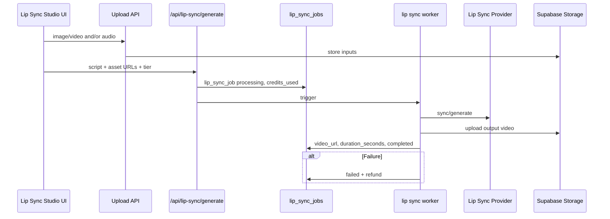

# InfluExAi — Lip Sync Studio Implementation Plan

**Document type:** Technical implementation specification  
**Audience:** Engineering, product, operations, legal/compliance (review before Live)  
**Status:** **Beta (feature-flagged)**  
**Last updated:** 2026-05-27 (finalized)
**Related:** [CREDIT_AND_MODE_STRATEGY.md](./CREDIT_AND_MODE_STRATEGY.md), [ROADMAP_IMAGE_VIDEO_MODES.md](./ROADMAP_IMAGE_VIDEO_MODES.md), [VIDEO_STUDIO_IMPLEMENTATION_PLAN.md](./VIDEO_STUDIO_IMPLEMENTATION_PLAN.md)

This specification describes **Lip Sync Studio** integration. Runtime is gated by feature flags:

- `ENABLE_FAL_LIP_SYNC` + `NEXT_PUBLIC_ENABLE_FAL_LIP_SYNC`
- `ENABLE_ELEVENLABS_TTS` + `NEXT_PUBLIC_ENABLE_ELEVENLABS_TTS` (System Voice mode)

---

## 1. Goal

Lip Sync Studio produces **talking creator clips** from **source video + audio** with two modes:

1. **Upload Audio**: user uploads own audio.
2. **System Voice**: user enters script + voice style, ElevenLabs generates audio first.

| Objective | Detail |
|-----------|--------|
| Core output | Lip-synced video in `generations.video_url` |
| Inputs | Source video URL + (`audio_url` or `script_text` + `voice_key`) |
| Credits | **30** (Upload Audio) / **35** (System Voice) |
| MVP scope | No auto social posting, no extra lip-sync providers beyond `fal-ai/sync-lipsync/v2/pro` |

---

## 2. Future provider candidates

## 2b. Current provider chain (implemented)

- Lip sync provider: `fal-ai/sync-lipsync/v2/pro`
- System Voice TTS provider: ElevenLabs `eleven_multilingual_v2`
- **21 named voices** (`roger`, `sarah`, `laura`, `charlie`, `george`, `callum`, `river`, `harry`, `liam`, `alice`, `matilda`, `will`, `jessica`, `eric`, `bella`, `chris`, `brian`, `daniel`, `lily`, `adam`, `bill`) map to `ELEVENLABS_VOICE_*` env vars (see [ENVIRONMENT_VARIABLES.md](./ENVIRONMENT_VARIABLES.md)).
- **8 category presets** (`female_natural`, `female_soft`, `female_energetic`, `female_premium`, `male_natural`, `male_deep`, `male_storytelling`, `male_energetic`) remain supported as aliases.
- Default `voiceKey` when omitted: `sarah` if `ELEVENLABS_VOICE_SARAH` is set, else `female_natural` if configured, else `sarah`.
- UI: Voice Library with Recommended, Female, Male, and Category sections. Preview via local `public/audio/voices/{voiceKey}.mp3` (no ElevenLabs call). Optional `NEXT_PUBLIC_ELEVENLABS_CONFIGURED_VOICE_KEYS` disables unlisted voices in the UI.

### Local voice preview generation (dev tool)

Generate missing preview MP3s from configured `ELEVENLABS_VOICE_*` IDs in `.env.local`:

```bash
node scripts/generate-elevenlabs-voice-previews.mjs
```

**Requirements**

- `ELEVENLABS_API_KEY` in `.env.local` or the shell environment (never commit real keys).
- Each target voice has its matching `ELEVENLABS_VOICE_*` variable set (e.g. `ELEVENLABS_VOICE_SARAH` for `sarah`).

**Behavior**

- Writes to `public/audio/voices/{voiceKey}.mp3`.
- Skips files that already exist.
- Logs: `created`, `skipped`, `missing env`, `failed`.
- Uses ElevenLabs `eleven_multilingual_v2` with the same preview sentence for all voices.
- One-time dev setup; the dashboard Listen button does not call ElevenLabs at runtime.

If a selected voice key has no configured voice ID, the worker marks the job as failed with refund and
`Selected system voice is not configured.` Upload Audio remains the fallback path.

### 2c. Finalized input modes (implemented)

1. **System Voice**  
   Input: `sourceVideoUrl + scriptText + voiceKey`  
   Billing: **35 credits**

2. **Upload Audio**  
   Input: `sourceVideoUrl + audioUrl`  
   Billing: **30 credits**

Output for both: `video_url` generated via `fal-ai/sync-lipsync/v2/pro`.

| Category | Examples (evaluate at implementation) |
|----------|----------------------------------------|
| **Lip sync / talking avatar** | Vendor APIs specialized in face-driven speech |
| **Voice-to-video** | Speech-driven motion without separate TTS step |
| **TTS + lip sync chain** | Optional: internal voice generation later, then sync |

| Rule | Requirement |
|------|-------------|
| **No activation in MVP** | No lip-sync routes or production keys |
| **Policy review** | Likeness, voice cloning, synthetic media terms before Live |

User-facing label: **Lip Sync Studio** — not vendor names until stable.

---

## 3. Use cases

| Use case | Input pattern |
|----------|----------------|
| Image + audio/script | Uploaded portrait + voice track or script |
| Video + new audio | Re-voice short clip |
| Talking creator ad | Creator still + ad script |
| Product testimonial | Product/creator visual + spoken line |
| Short-form UGC ad | Vertical clip for paid social |
| Avatar campaign snippet | Brand-safe talking head for promos |

---

## 4. Suggested credit model

| Tier | Credits | Notes |
|------|---------|--------|
| **Short clip** | **10–30** | Low duration, standard quality |
| **Longer / premium clip** | **30–60** | Longer runtime or HD/premium provider |
| **Final pricing** | TBD | Depends on **duration**, **provider**, and **quality** tier |

Dimensions for pricing matrix:

- Duration buckets (e.g. ≤15 s, ≤30 s, ≤60 s)
- Resolution
- Provider COGS per second

Debit/reserve credits **before** provider call. Show estimate in UI.

---

## 5. Future flow



### Proposed job type

| Field | Example |
|-------|---------|
| `workflow` / `mode` | `lip_sync` |
| `provider` | Vendor slug |
| `model` | Provider model id |

Separate from Video Studio worker to isolate timeouts, polling, and refunds.

**Optional later:** Voice generation step before lip sync (not in v1).

---

## 6. Future database fields

Proposed table `lip_sync_jobs` or extended `generations`:

| Field | Purpose |
|-------|---------|
| `source_image_url` | Talking-head still |
| `source_video_url` | Optional motion reference |
| `audio_url` | Uploaded speech audio |
| `script_text` | Text driving TTS or provider script |
| `video_url` | Output clip |
| `duration_seconds` | Billing and UI |
| `provider_job_id` | Async polling |
| `credit_cost` / `credits_used` | Debit audit |
| `status` | `processing` \| `completed` \| `failed` |
| `error_message` | User-safe failure text |

---

## 7. Safety requirements

| Rule | Requirement |
|------|-------------|
| File type validation | Allow only approved image/video/audio MIME types |
| Upload size limits | Cap image, video, and audio bytes server-side |
| Duration limits | Max audio/video length per tier |
| No provider without credits | Consume/reserve before external API |
| Refund on failure | Full debit refunded |
| Moderation / usage policy | Review before public Live (likeness, impersonation, minors) |
| No Live without production test | Full Vercel path green |
| Storage test | Upload → provider read → output write verified first |
| Standard Image unaffected | No changes to OpenAI image worker |

---

## 8. UI requirements later

| Requirement | Detail |
|-------------|--------|
| Module disabled | Until `LIP_SYNC_ENABLED` and backend ready |
| Upload / select asset | File picker or Gallery picker |
| Script input | Text area; optional audio upload instead |
| Estimated credits | Tier by duration before confirm |
| Processing status | Job polling UI |
| Result preview | Inline video player |
| Download / export | MP4 link |
| Badge | **Coming soon** / Planned in MVP |

---

## 9. Test plan

| # | Test | Expected |
|---|------|----------|
| 1 | Upload image | Valid types OK; invalid rejected |
| 2 | Upload audio | Size/duration enforced |
| 3 | Local job | `completed` + `video_url` |
| 4 | Production job | Vercel worker + secrets |
| 5 | Failed provider refund | Credits restored |
| 6 | Video playback | Desktop |
| 7 | Mobile playback | Acceptable on phones |
| 8 | Storage cleanup | Failed/orphan objects policy documented |
| 9 | Credit deduction | Matches tier |
| 10 | Gallery/metadata | Lip Sync badge on result |

---

## 10. Rollout plan

| Step | Scope | Deliverable |
|------|--------|-------------|
| **1** | Documentation only | This file (**current step**) |
| **2** | Internal prototype | Flag off in production |
| **3** | Admin-only testing | Allowlisted accounts |
| **4** | Limited release | Monitor failure rate and COGS |
| **5** | Pricing refinement | Adjust 10–60 bands from data |

**Phase alignment:** Lip Sync Studio = **Phase 7** in [CREDIT_AND_MODE_STRATEGY.md](./CREDIT_AND_MODE_STRATEGY.md) §10 (after Video Studio Phase 6).

---

## 11. Out of scope for Lip Sync v1

- Full Video Studio feature parity
- Cinema Agent batch orchestration
- Public Live UI in MVP
- Voice cloning without explicit user consent flows
- New packages without review

---

## Document maintenance

- Update credit bands and provider list when benchmarks complete.
- Legal review checkpoint before Step 4 (limited release).

**Owner:** Platform engineering
