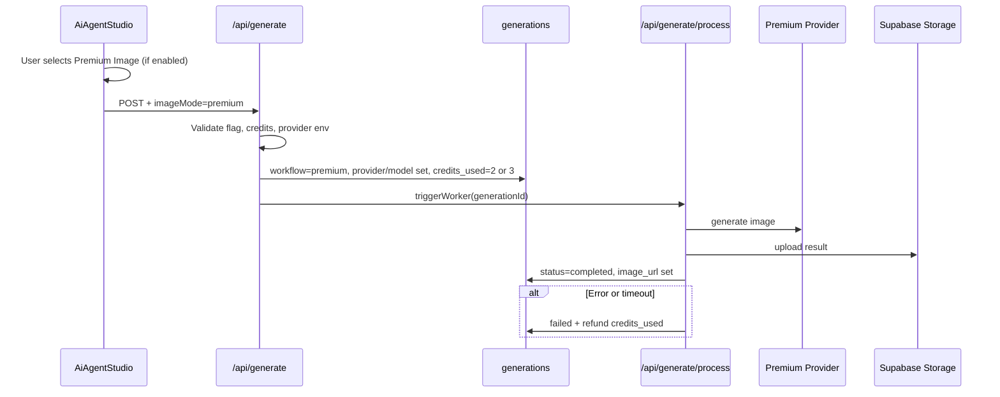

# InfluExAi — Premium Image Mode Implementation Plan

**Document type:** Technical implementation specification  
**Audience:** Engineering, product, operations  
**Status:** Planning only — **no provider activated**, **no code changes authorized by this document**  
**Last updated:** 2026-05-22  
**Related:** [CREDIT_AND_MODE_STRATEGY.md](./CREDIT_AND_MODE_STRATEGY.md), [ROADMAP_IMAGE_VIDEO_MODES.md](./ROADMAP_IMAGE_VIDEO_MODES.md), [FAST_DRAFT_IMPLEMENTATION_PLAN.md](./FAST_DRAFT_IMPLEMENTATION_PLAN.md)

This specification describes how **Premium Image** should be integrated alongside **Standard Image** and other planned modes. It does not enable Premium Image in production.

---

## 1. Goal

Premium Image Mode shall produce **high-quality campaign visuals** for use cases that need more fidelity and stronger prompt adherence than Standard Image.

| Use case | Examples |
|----------|----------|
| Campaign hero assets | Launch visuals, paid social heroes |
| Creator visuals | Profile-grade portraits, brand-aligned creator shots |
| Product campaigns | Product-focused ads, ecommerce creatives |
| Premium social assets | Feed posts, carousels where quality bar is higher than draft/fast paths |

Premium is **opt-in** and **higher credit cost** than Standard. It is not the default mode.

---

## 2. Future provider candidates

Evaluate at implementation time (quality, latency, COGS, ToS, regional compliance). **No provider is active** until signed off.

| Candidate | Role (proposed) |
|-----------|-----------------|
| **FLUX Dev** | High-quality generation via fal or equivalent host |
| **FLUX Pro** | Top-tier fidelity when COGS allows |
| **Nano Banana Pro** | Alternative premium host; compare against FLUX |
| **Other premium providers** | Add to shortlist if benchmarks beat incumbents |

### Proposed metadata values (TBD per winner)

| Field | Example |
|-------|---------|
| `workflow` | `premium` |
| `provider` | `fal`, `replicate`, or vendor-specific slug |
| `model` | `flux-dev`, `flux-pro`, `nano-banana-pro` (exact ids at integration) |

Do not expose vendor names in user-facing UI as Live features until the integration is stable. Marketing label: **Premium Image**.

---

## 3. Suggested credit cost

| Tier | Credits | Notes |
|------|---------|--------|
| **Suggested range** | **2–3 credits** per image | Set in [CREDIT_AND_MODE_STRATEGY.md](./CREDIT_AND_MODE_STRATEGY.md) |
| **Final price** | TBD | Lock only after provider cost test (COGS per job vs credit revenue) |

Implementation must debit the **exact** `credits_used` stored on the row before the provider call. If pricing tiers differ by resolution, document mapping in API validation (e.g. 2 credits for standard aspect, 3 for largest format).

---

## 4. Current live baseline

| Field | Value |
|-------|--------|
| **Mode** | Standard Image |
| **Provider** | OpenAI |
| **Model** | `gpt-image-1` |
| **Workflow** | `standard` |
| **Credit cost** | **1 credit** |
| **Status** | Live — **stable fallback** |

All Premium work must preserve the Standard path unchanged. Provider outages or Premium bugs must not degrade Standard jobs.

**Baseline flow (reference):**

- `POST /api/generate` → insert `generations` → consume credits → `triggerWorker`
- `POST /api/generate/process` → OpenAI branch when `workflow === standard` && `provider === openai`
- Upload to Supabase Storage `generations` bucket → `image_url` → gallery

See [FAST_DRAFT_IMPLEMENTATION_PLAN.md](./FAST_DRAFT_IMPLEMENTATION_PLAN.md) §3 for sequence detail.

---

## 5. Future Premium flow

When implemented behind a feature flag:



### Target row shape (proposed)

| Column | Premium value |
|--------|----------------|
| `workflow` | `premium` |
| `provider` | Selected vendor slug |
| `model` | e.g. `flux-pro`, `flux-dev`, `nano-banana-pro` |
| `credits_used` | `2` or `3` (final after COGS test) |
| `status` | `processing` → `completed` \| `failed` |
| `final_prompt` | Shared Creative Prompt Engine output (same brief pipeline as Standard) |
| `image_size`, `output_width`, `output_height` | From output format selector |

### Worker routing (proposed)

```
if workflow === "standard" && provider === "openai":
  → processOpenAIImage()      // untouched
else if workflow === "premium":
  → processPremiumImage()     // new isolated module
else if workflow === "fast_draft":
  → processFastDraftImage()   // when shipped
else:
  → markFailedAndRefund()
```

Today the worker refunds non-standard workflows with an MVP disabled message — Premium must only be allowed when explicitly enabled via feature flag and allowlist.

---

## 6. Safety requirements

| Rule | Requirement |
|------|-------------|
| Standard fallback | Default UI and API remain Standard; Premium opt-in only |
| Provider isolation | Premium provider failure must not affect Standard worker path or env |
| Timeout | Max job duration; `failed` + refund, no stuck `processing` |
| Refund on provider error | Existing `refund_user_credits` + `markFailedAndRefund` |
| No duplicate jobs | Skip if `status !== processing`; idempotent worker |
| No UI before backend | Premium card stays Planned/disabled until API + worker + pricing ship |
| Production test | Full Vercel path before any user-facing Live badge |
| Cost monitoring | Track COGS; adjust credits only with product sign-off |
| No provider in UI | Do not show FLUX/vendor names as Live until stable |

Aligned with [CREDIT_AND_MODE_STRATEGY.md](./CREDIT_AND_MODE_STRATEGY.md) §9 and §11.

---

## 7. Metadata needed

### Required (existing columns — sufficient for v1)

| Field | Purpose |
|-------|---------|
| `provider` | Vendor slug |
| `model` | Exact model id |
| `workflow` | `premium` (or dedicated `mode` when added) |
| `credits_used` | Debit amount (2 or 3) |
| `image_size` | Provider aspect/size input |
| `output_width` / `output_height` | Gallery/layout |
| `image_url` | Result URL |
| `status`, `error_message`, `failed_at` | Failure handling |

### Optional (recommended for operations)

| Field | Purpose |
|-------|---------|
| `provider_job_id` | Async job id for support and polling |
| `provider_latency_ms` | Performance and cost tuning |

---

## 8. UI requirements later

**Current state:** `AiAgentStudio.tsx` lists Premium Image as **Planned**; selection locked to `standard`; no `imageMode` sent to API.

| Requirement | Detail |
|-------------|--------|
| Enable Premium button | Only when `PREMIUM_IMAGE_ENABLED` (server) and tests pass |
| Credit cost visible | Show **2–3 credits** (exact number once pricing locked) |
| Marketing copy | **“Premium Image — higher quality campaign visuals”** (EN/DE via i18n) |
| No provider branding | No “FLUX Pro Live” etc. until integration stable |
| Submit payload | `imageMode: "premium"` only when backend ready |
| Gallery badge | Distinguish Premium vs Standard vs Fast Draft |

Optional: `CreditsCard.tsx` — short note that Premium costs more than Standard (1 credit).

---

## 9. Test plan

| # | Test | Expected |
|---|------|----------|
| 1 | Local generation (flag on) | `completed`, valid `image_url` |
| 2 | Production generation (Vercel) | Worker auth + provider env OK |
| 3 | Credits deducted correctly | Balance −2 or −3 per configured price |
| 4 | Refund on failure | Forced provider error → `failed`, credits restored |
| 5 | Storage upload | PNG/JPEG in `generations` bucket, public URL works |
| 6 | Gallery display | List and detail render Premium result |
| 7 | Mobile result display | Agent + gallery usable on small screens |
| 8 | Provider timeout | Job fails + refund within SLA |
| 9 | Fallback behavior | Standard job unchanged when Premium flag on |
| 10 | Regression | Fast Draft (if live) and Standard both pass smoke tests |

---

## 10. Rollout plan

| Step | Scope | Deliverable |
|------|--------|-------------|
| **1** | Documentation only | This file + strategy/roadmap links (**current step**) |
| **2** | Backend behind feature flag | API + `processPremiumImage()`; `PREMIUM_IMAGE_ENABLED=false` in prod |
| **3** | Manual internal test | §9 checklist in staging/preview |
| **4** | Admin-only UI activation | Allowlisted users; Premium card enabled internally |
| **5** | Limited user release | Gradual rollout; monitor errors and COGS |
| **6** | Cost monitoring | Weekly fal/vendor spend vs credit revenue; tune 2 vs 3 credits |

**Phase alignment:** Premium Image = **Phase 3** in [CREDIT_AND_MODE_STRATEGY.md](./CREDIT_AND_MODE_STRATEGY.md) §10 (after Fast Draft Phase 2).

**Prerequisite:** Fast Draft (Phase 2) optional but recommended to validate multi-workflow worker pattern before Premium.

---

## 11. API changes needed later (reference only)

### `app/api/generate/route.ts`

- Accept `imageMode: "premium"` only when flag + provider env valid.
- Map to `workflow: "premium"`, `provider`, `model`, `credits_used: 2 | 3`.
- Reject insufficient credits before provider call.
- Keep Standard insert path unchanged.

### `app/api/generate/process/route.ts`

- Add `processPremiumImage()` branch.
- Do not modify `processOpenAIImage()` internals.
- Extend worker allowlist beyond `standard` when flags permit.

---

## 12. Out of scope for Premium v1

- Replacing Standard as default
- Reference Edit (separate spec: [REFERENCE_EDIT_IMPLEMENTATION_PLAN.md](./REFERENCE_EDIT_IMPLEMENTATION_PLAN.md))
- Video, Lip Sync, Brand Assets, Watermarked Promo
- New npm packages without security review
- Changing Stripe SKUs without migration plan

---

## Document maintenance

- Update provider shortlist and final credit price when COGS known.
- Cross-link PRs touching generate routes, worker, Image Mode UI.

**Owner:** Platform engineering
