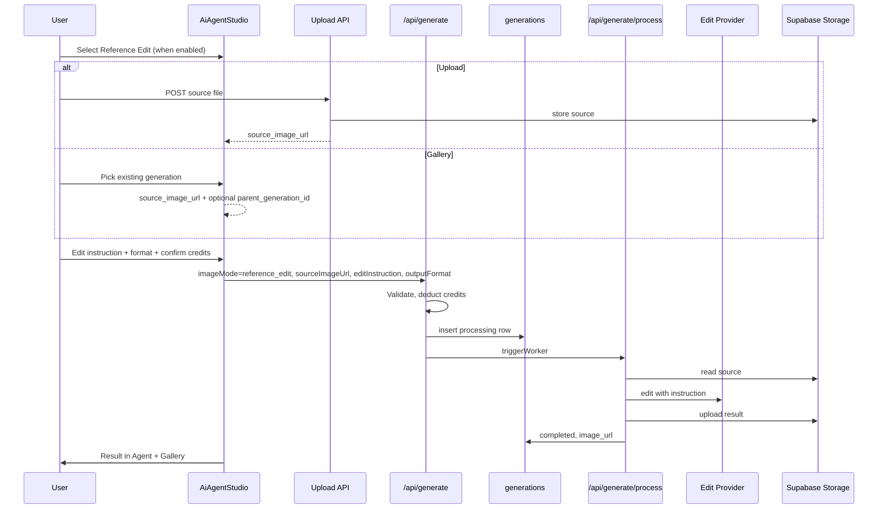

# InfluExAi — Reference Edit Backend Implementation Plan

**Document type:** Backend and data-flow specification  
**Audience:** Engineering, product, operations  
**Status:** Planning only — **no provider activated**, **no backend changes authorized by this document**  
**Last updated:** 2026-05-22  
**Related:** [REFERENCE_EDIT_IMPLEMENTATION_PLAN.md](./REFERENCE_EDIT_IMPLEMENTATION_PLAN.md), [CREDIT_AND_MODE_STRATEGY.md](./CREDIT_AND_MODE_STRATEGY.md), [FAST_DRAFT_IMPLEMENTATION_PLAN.md](./FAST_DRAFT_IMPLEMENTATION_PLAN.md), [reference-edit-sql.md](./reference-edit-sql.md)

This document defines what is required to implement **Reference Edit** in production. Today Reference Edit is **UI-prepared only** (planned panel, disabled mode, no API). Standard, Fast Draft, and Premium Image remain the only active generation paths.

---

## 1. Goal

Reference Edit shall allow users to:

1. **Upload** a source image or **select** an existing asset from the Gallery  
2. Enter an **edit instruction** (what to change)  
3. Choose **social output format** (aspect / dimensions)  
4. Confirm **estimated credits** and run a single edit job  
5. Receive the **edited result** in the Agent and Gallery  

No text-to-image replacement — this is an **edit pipeline** alongside Standard / Fast Draft / Premium.

---

## 2. Future provider candidates

Evaluate before activation (edit fidelity, reference conditioning, latency, COGS, ToS).

| Candidate | Role (proposed) |
|-----------|-----------------|
| **Nano Banana** | Reference-guided edit / image-to-image refinement |
| **Nano Banana Pro** | Higher-quality edits; higher COGS |
| **FLUX Kontext** | Context-conditioned edits via fal.ai |
| **Other fal.ai editing endpoints** | Inpaint, outpaint, background replace |

**Provider strategy (product):** Prefer **fal.ai** for additional modes where possible, consistent with Fast Draft and Premium Image.

### Proposed job metadata (TBD per winner)

| Field | Example |
|-------|---------|
| `workflow` | `reference_edit` |
| `provider` | `fal` |
| `model` | e.g. `fal-ai/flux-kontext` or Nano Banana endpoint id |

User-facing label: **Reference Edit** — no vendor names in Live UI until stable.

---

## 3. Required user flow

| Step | Requirement |
|------|-------------|
| 1 | User selects **Reference Edit** (only when feature flags on) |
| 2 | User provides **source image** (upload or Gallery) |
| 3 | User enters **edit instruction** |
| 4 | User selects **social format** (reuse output format selector) |
| 5 | UI shows **estimated credits** (2–4 band; start at 2 for first test) |
| 6 | User **confirms** — no silent provider call |
| 7 | Job created → processing → result in Agent + Gallery |

---

## 4. Required storage flow

| Step | Storage behavior |
|------|------------------|
| **Source upload** | Authenticated upload → bucket **`reference-sources`** via service role (`{user_id}/{uuid}.png`) |
| **Source URL** | Persist **`source_image_url`** on `generations` row (public URL from `reference-sources` or Gallery `image_url`) |
| **Provider read** | Worker downloads source from URL before edit call |
| **Result** | Same pattern as image modes: buffer → upload → bucket **`generations`** → **`generations.image_url`** |
| **Gallery lineage** | If source from Gallery: set **`parent_generation_id`** to source `generations.id` |

**Phase 2 SQL (prepared, not auto-applied):** [reference-edit-sql.md](./reference-edit-sql.md) and [../supabase/migrations/20260523100000_reference_edit_phase2.sql](../supabase/migrations/20260523100000_reference_edit_phase2.sql).

**Do not** skip storage test: no provider call until upload → read → delete lifecycle is verified in staging.

**Important — existing column `reference_image_url`:**

Today `reference_image_url` on `generations` is used for **Style Profile / character** reference on Standard (and planned modes), **not** for user-uploaded edit sources. Do **not** overload it for Reference Edit without a migration plan.

| Column | Current MVP use | Reference Edit use |
|--------|-----------------|-------------------|
| `reference_image_url` | Character style reference when `character_id` set | Keep for style profile only |
| `source_image_url` (new) | — | User upload or Gallery source for edit |

---

## 5. Required database fields

### Existing columns (partially sufficient)

| Column | Reference Edit usage |
|--------|----------------------|
| `workflow` | `reference_edit` |
| `provider` | `fal` (or vendor slug) |
| `model` | Provider model id |
| `credits_used` | 2–4 (audit debit) |
| `image_url` | Edited output URL |
| `image_size`, `output_width`, `output_height` | Target format |
| `prompt` | Raw user brief (optional) |
| `final_prompt` | Combined brief + edit instruction for worker |
| `status`, `error_message`, `failed_at`, `completed_at` | Standard job lifecycle |
| `user_id`, `character_id` | Optional style profile |
| `reference_image_url` | **Do not repurpose** — character reference only |

### Recommended new columns (evaluate migration)

| Column | Purpose |
|--------|---------|
| `source_image_url` | **Required** for edit jobs — upload or Gallery URL |
| `edit_instruction` | User’s transformation brief (or merge into `final_prompt` short-term) |
| `parent_generation_id` | Link to source Gallery row when editing existing asset |
| `mode` | Mirror UI `imageMode` if `workflow` naming insufficient |
| `provider_job_id` | Async job id for polling / support |
| `provider_latency_ms` | Ops and cost tuning |

**v1 without migration (not recommended long-term):** Store `source_image_url` only if column added; temporarily encoding source URL in `final_prompt` is **not** acceptable for production.

---

## 6. Required API changes later

**Not authorized until phased rollout.** Listed for implementation reference only.

### Upload

| Option | Notes |
|--------|--------|
| **New route** | e.g. `POST /api/generate/upload-source` — auth, validate MIME/size, return URL |
| **Reuse** | `POST /api/characters/upload-reference` — only if security/path rules fit edit sources (likely **new route** cleaner) |

### `app/api/generate/route.ts`

| Change | Detail |
|--------|--------|
| Accept `imageMode: "reference_edit"` | Only when `ENABLE_FAL_REFERENCE_EDIT=true` (name TBD) |
| Body fields | `sourceImageUrl`, `editInstruction`, `outputFormat`, optional `parentGenerationId`, optional `characterId` |
| Validation | Source URL required; instruction non-empty; user owns source (Gallery) or URL from own upload prefix |
| Credits | `consume_user_credits` with `credits_used: 2` (initial test tier) **before** insert + worker |
| Insert | `workflow: reference_edit`, `provider`, `model`, `source_image_url`, `credits_used` |
| Transaction source | `reference_edit_generation_job` |
| Reject | 400 if flag off or missing source |

### `app/api/generate/process/route.ts`

| Change | Detail |
|--------|--------|
| New branch | `processReferenceEdit()` when `workflow === reference_edit` && `provider === fal` |
| Unchanged | `processOpenAIImage`, `processFastDraftImage`, `processPremiumImage` |
| Worker steps | Fetch source → call provider → download result → upload → `completed` |
| Failure | `markFailedAndRefund` full `credits_used` |

### Validation rules

| Rule | Enforcement |
|------|-------------|
| File type | `image/jpeg`, `image/png`, `image/webp` (server-side on upload) |
| File size | e.g. max 10–15 MB (TBD) |
| Source present | No provider call if `source_image_url` null |
| Credits | No provider call if debit failed |
| Timeout | Worker max duration; `failed` + refund |

---

## 7. Credit model

| Tier | Credits | Notes |
|------|---------|--------|
| **Suggested range** | **3–5** per job | [CREDIT_AND_MODE_STRATEGY.md](./CREDIT_AND_MODE_STRATEGY.md) §4 |
| **First provider test** | **3 credits** | Start after COGS sign-off |
| **Later** | 4–5 | Complex edits or Pro model |

| Rule | Requirement |
|------|-------------|
| Show estimate | UI modal before confirm |
| Debit timing | Before provider call (same as other modes) |
| Refund | Full `credits_used` on failure |
| No hidden bundle | Reference Edit priced separately from Standard/Fast/Premium |

---

## 8. Safety rules

| Rule | Requirement |
|------|-------------|
| No provider without `source_image_url` | Hard guard in API + worker |
| No provider without credits | Debit or reject |
| File limits | Size + MIME on upload |
| Timeout | Stale `processing` → failed + refund |
| Idempotency | Skip duplicate worker on non-`processing` status |
| Mode isolation | Reference Edit code paths must not alter Standard / Fast Draft / Premium |
| Feature flags | `ENABLE_FAL_REFERENCE_EDIT` (server) + `NEXT_PUBLIC_ENABLE_FAL_REFERENCE_EDIT` (UI) — default **false** |
| Full backend before Live | UI Live badge only when upload + worker + refund tested |
| Likeness / policy | Review terms for user-uploaded faces (legal/product) |

---

## 9. UI requirements later

**Today (Phase 1):** Mockup panel + disabled mode card — see [REFERENCE_EDIT_IMPLEMENTATION_PLAN.md](./REFERENCE_EDIT_IMPLEMENTATION_PLAN.md) §5.

| Requirement | Detail |
|-------------|--------|
| Source preview | Thumbnail after upload or Gallery pick |
| Upload / select | File picker + Gallery picker |
| Edit instruction | Enabled textarea when mode Live |
| Format selector | Reuse existing output formats |
| Estimated credits | Shown before confirm |
| Generate disabled | Until source + instruction present |
| Agent result | Same polling as other modes |
| View in Gallery | Standard gallery actions |

Submit must send `imageMode: "reference_edit"` only when flags on — never today.

---

## 10. Gallery requirements later

| Requirement | Detail |
|-------------|--------|
| Result display | `image_url` thumbnail/list like other jobs |
| Metadata | Badge **Reference Edit**; optional source thumb on detail |
| Lineage | `parent_generation_id` → link “Edited from” on detail page |
| Regenerate | Re-queue with same source + instruction (future) |
| Edit again | “Edit this image” → pre-fill source from Gallery row (future) |

API `GET /api/generations` may need to return `source_image_url` / `parent_generation_id` when columns exist (read-only extension).

---

## 11. Implementation phases

| Phase | Scope | Status |
|-------|--------|--------|
| **1** | UI mockup / disabled state | **Done** (Agent panel, local preview, no API) |
| **2** | DB + storage prepare | **SQL prepared** — run migration manually; bucket `reference-sources` |
| **2b** | Storage / upload prototype | Upload route + service-role path; no public edit |
| **3** | Generation row with `source_image_url` | Insert from API (flag off) after migration applied |
| **4** | Provider test locally | fal edit endpoint; worker branch behind flag |
| **5** | Refund / error handling | Parity with Fast Draft / Premium |
| **6** | Admin-only activation | Allowlisted users |
| **7** | Public activation | Flags on; monitor COGS |

Aligned with [CREDIT_AND_MODE_STRATEGY.md](./CREDIT_AND_MODE_STRATEGY.md) Phase 4 (Reference Edit).

---

## 12. Test checklist

Use before marking Reference Edit **Live**.

### Upload & validation

- [ ] Upload valid JPEG/PNG/WebP → `source_image_url` returned  
- [ ] Reject invalid MIME  
- [ ] Reject file over size limit  
- [ ] Gallery pick sets `parent_generation_id` + `source_image_url`  
- [ ] Cannot use another user’s generation as source  

### Job & credits

- [ ] Create job with `workflow: reference_edit`  
- [ ] Credits deducted (3 on first tier) before provider  
- [ ] Insufficient credits → 402, no provider call  
- [ ] Flag off → 400, no debit  

### Worker & provider

- [ ] Local worker success → `completed`, `image_url` set  
- [ ] Production worker (Vercel) success  
- [ ] Provider failure → `failed`, credits refunded, `credits_used: 0`  
- [ ] Provider timeout → failed + refund  
- [ ] Duplicate worker POST → no double charge  

### Storage & gallery

- [ ] Source stored and readable by worker  
- [ ] Result uploaded to `generations` bucket  
- [ ] Gallery list/detail shows result  
- [ ] Detail shows source metadata / parent link (when UI ready)  

### Regression

- [ ] Standard Image unchanged  
- [ ] Fast Draft unchanged  
- [ ] Premium Image unchanged  
- [ ] Mobile upload + layout acceptable  

### Production

- [ ] End-to-end on Vercel with `FAL_KEY` + flags  
- [ ] COGS per job documented vs 3-credit price  

---

## 13. Environment variables (proposed)

| Variable | Side | Default |
|----------|------|---------|
| `ENABLE_FAL_REFERENCE_EDIT` | Server | `false` |
| `NEXT_PUBLIC_ENABLE_FAL_REFERENCE_EDIT` | Client | `false` |
| `FAL_KEY` | Server | Required when enabled (shared with other fal modes) |

Add placeholders to `.env.example` only when implementation starts — not required for this documentation-only change.

---

## 14. Out of scope

- Activating Reference Edit in current MVP  
- Video, Lip Sync, LoRA, Face Consistency, Character Pro training  
- Replicate or non-fal providers unless explicitly approved  
- Using `reference_image_url` as edit source without migration  
- Changing Stripe, credits RPC, or auth  

---

## Document maintenance

- Update provider shortlist and credit tier when benchmarks complete.  
- Link PRs touching upload routes, `generations` schema, worker branch, Gallery detail.  
- When Phase 2 starts, cross-update [REFERENCE_EDIT_IMPLEMENTATION_PLAN.md](./REFERENCE_EDIT_IMPLEMENTATION_PLAN.md) rollout table.

**Owner:** Platform engineering
