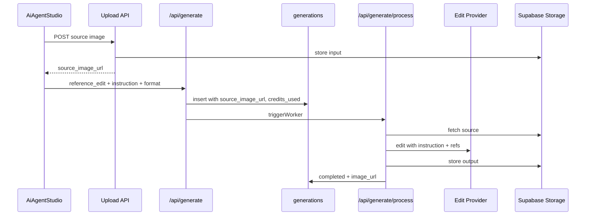

# InfluExAi — Reference Edit Mode Implementation Plan

**Document type:** Technical implementation specification  
**Audience:** Engineering, product, operations  
**Status:** Planning only — **no provider activated**, **no code changes authorized by this document**  
**Last updated:** 2026-05-22  
**Related:** [CREDIT_AND_MODE_STRATEGY.md](./CREDIT_AND_MODE_STRATEGY.md), [ROADMAP_IMAGE_VIDEO_MODES.md](./ROADMAP_IMAGE_VIDEO_MODES.md), [PREMIUM_IMAGE_IMPLEMENTATION_PLAN.md](./PREMIUM_IMAGE_IMPLEMENTATION_PLAN.md)

This specification describes how **Reference Edit** (reference-guided image editing) should be integrated. It does not enable Reference Edit in production.

---

## 1. Goal

Reference Edit Mode shall let users **edit existing images** or use **reference images** as the visual basis for guided transformations—without replacing Standard Image generation.

| Objective | Detail |
|-----------|--------|
| Core capability | Input image + text instructions → edited output |
| Positioning | Campaign refinements, variations, format adjustments |
| Relationship to Standard | Separate workflow; Standard remains text-to-image default |
| Activation | No edit API or UI upload path until storage, credits, and worker are ready |

---

## 2. Future provider candidates

Evaluate at implementation (edit quality, mask/inpaint support, latency, COGS).

| Candidate | Notes |
|-----------|--------|
| **Nano Banana** | Reference-guided edit APIs |
| **Nano Banana Pro** | Higher-quality edits; higher COGS |
| **FLUX Kontext** | Context/reference-conditioned edits via fal or host |
| **Other image editing providers** | Inpaint, outpaint, background replace vendors |

### Proposed metadata values (TBD)

| Field | Example |
|-------|---------|
| `workflow` | `reference_edit` |
| `provider` | `fal`, `replicate`, or vendor slug |
| `model` | Provider-specific edit model id |

User-facing label: **Reference Edit** — not vendor trademarks until Live.

---

## 3. Use cases

| Use case | Description |
|----------|-------------|
| Product image improvement | Enhance lighting, detail, or composition on existing product shots |
| Background change | Replace or simplify backgrounds for ads |
| Creator asset variation | New pose/expression/outfit while keeping likeness reference |
| Social format adaptation | Reframe or extend for TikTok, Reels, YouTube thumbnail ratios |
| Reference → campaign style | Transfer mood/lighting/color from reference into new composition |
| Style Profile combination | Optional `character_id` / style profile + source image for brand-consistent edits |

---

## 4. Suggested credit cost

| Tier | Credits | Notes |
|------|---------|--------|
| **Suggested range** | **2–4 credits** per job | See [CREDIT_AND_MODE_STRATEGY.md](./CREDIT_AND_MODE_STRATEGY.md) |
| **Pricing drivers** | Simple background swap vs multi-region edit vs Pro model |
| **Final price** | TBD after provider cost test per edit type |

Debit credits **before** provider call. Store actual debit in `credits_used` (and optional `credit_cost` when column exists).

---

## 5. Required future UI

**Current state:** Reference Edit card in `AiAgentStudio.tsx` is **Planned** and not selectable; no source upload in Agent for edit mode.

| UI element | Requirement |
|------------|-------------|
| **Upload source image** | File picker or drag-drop; show size/type limits |
| **Preview input image** | Thumbnail before generate |
| **Select target format** | Reuse output format selector (platform, aspect, dimensions) |
| **Prompt edit instructions** | Dedicated field: “what to change” (separate from full scene prompt) |
| **Optional Style Profile** | Link `character_id` when style DNA applies |
| **Generate edited result** | Submit only when backend + credits validated |
| **Status** | Planned badge until Live |

### Copy (later — EN examples; mirror in DE i18n)

| State | Copy |
|-------|------|
| Planned | **“Reference Edit — planned”** |
| Description | **“Upload an image and guide the transformation.”** |
| Disabled | **“Not active yet”** until backend ready |

Do not mark Live in UI until upload API, worker edit branch, and refunds are tested.

---

## 6. Required future backend

### Upload path

1. User uploads source image (authenticated).
2. Server validates type (e.g. `image/jpeg`, `image/png`, `image/webp`) and max size (e.g. 10–15 MB — TBD).
3. Store in Supabase Storage (proposed bucket: `generations` or dedicated `reference-inputs/{userId}/`).
4. Persist **`source_image_url`** (public or signed URL policy TBD) on `generations` row.

### Generation path

1. `POST /api/generate` with `imageMode: "reference_edit"`, `sourceImageUrl` or upload token, `editInstruction`, optional `characterId`, output format.
2. Validate credits (2–4) → `consume_user_credits`.
3. Insert row: `workflow: reference_edit`, `provider`, `model`, `credits_used`, `source_image_url`, `edit_instruction` (when column exists), `reference_image_url` if secondary ref needed.
4. `triggerWorker(generationId)`.
5. Worker: `processReferenceEdit()` — download source → call provider → upload result → `status: completed`, `image_url` set.
6. On failure: `failed` + **full refund** of `credits_used`.

### Gallery metadata

- Show **result** (`image_url`) as today.
- Detail view: optional **source thumbnail** + edit instruction summary.
- Badge: **Reference Edit**.

**No edit API activation without successful storage upload/download test** ([CREDIT_AND_MODE_STRATEGY.md](./CREDIT_AND_MODE_STRATEGY.md) §9).

---

## 7. Required future fields

### Minimum for v1 (may need migration)

| Field | Purpose |
|-------|---------|
| `source_image_url` | Input image for edit pipeline |
| `workflow` or `mode` | `reference_edit` |
| `provider` / `model` | Routing and support |
| `credits_used` | Debit amount (2–4) |

### Strongly recommended

| Field | Purpose |
|-------|---------|
| `edit_instruction` | User’s transformation brief (may map to `final_prompt` initially) |
| `provider_job_id` | External async job id |
| `reference_image_url` | Secondary reference (already used on Standard for character ref) |
| `parent_generation_id` | Link edit output to original gallery item (“edit from this”) |

### Existing columns reused

| Field | Usage |
|-------|--------|
| `reference_image_url` | Style/character reference in addition to source |
| `character_id` | Style Profile |
| `image_size`, `output_width`, `output_height` | Target format |
| `prompt` / `final_prompt` | Combined or split with `edit_instruction` |

Evaluate schema migration before Phase 4 rollout ([ROADMAP_IMAGE_VIDEO_MODES.md](./ROADMAP_IMAGE_VIDEO_MODES.md) §7).

---

## 8. Safety requirements

| Rule | Requirement |
|------|-------------|
| Storage test first | No provider call until upload → read → delete lifecycle verified |
| Refund on failure | Same RPC path as Standard; refund full `credits_used` |
| Upload size limit | Enforce max bytes server-side |
| File type validation | Reject non-images and suspicious MIME |
| No provider without credits | Consume credits before external API |
| Standard isolation | Reference Edit code paths must not alter Standard/OpenAI branch |
| No duplicate processing | Worker idempotency on `status === processing` |
| PII / likeness | Document terms for user-uploaded faces (product/legal) |
| Broken image handling | Gallery/UI graceful state if `source_image_url` or `image_url` 404 |

---

## 9. Future flow diagram

---

## 10. Test plan

| # | Test | Expected |
|---|------|----------|
| 1 | Upload image | Valid file stored; URL returned; invalid type rejected |
| 2 | Local edit (flag on) | `completed`, `image_url` + `source_image_url` persisted |
| 3 | Production edit | Vercel worker + env complete path |
| 4 | Credit deduction | Balance −2 to −4 per tier |
| 5 | Refund | Provider/storage failure → credits restored |
| 6 | Storage display | Source and result URLs load in browser |
| 7 | Gallery metadata | List/detail shows edit badge; source visible on detail |
| 8 | Mobile upload | File picker and preview usable |
| 9 | Broken image handling | Missing URL → safe empty/error state, no crash |
| 10 | Standard regression | Standard generation unaffected |

---

## 11. Rollout plan

| Step | Scope | Deliverable |
|------|--------|-------------|
| **1** | Documentation only | This file (**current step**) |
| **2** | Storage + upload API | Validated upload limits; no public edit yet |
| **3** | Backend behind flag | `REFERENCE_EDIT_ENABLED=false`; worker branch |
| **4** | Manual internal test | §10 checklist |
| **5** | Admin-only UI | Upload + generate for allowlisted users |
| **6** | Limited release + cost monitoring | Tune 2–4 credit tiers by edit type |

**Phase alignment:** Reference Edit = **Phase 4** in [CREDIT_AND_MODE_STRATEGY.md](./CREDIT_AND_MODE_STRATEGY.md) §10 (after Premium Phase 3).

---

## 12. API changes needed later (reference only)

### New or extended routes (proposed)

| Route | Purpose |
|-------|---------|
| `POST /api/generate/upload-source` (or similar) | Authenticated source upload → `source_image_url` |
| `POST /api/generate` | Accept `imageMode: "reference_edit"`, `sourceImageUrl`, `editInstruction` |

### `app/api/generate/process/route.ts`

- `processReferenceEdit()` — fetch source, call provider, upload output.
- Keep OpenAI Standard path untouched.

---

## 13. Out of scope for Reference Edit v1

- Full inpaint mask UI (may be v2)
- Video/image-to-video
- Batch edit automation
- Activating Premium or Fast Draft in same PR without isolated tests

---

## Document maintenance

- Update provider shortlist and credit tiers when benchmarks complete.
- Link PRs for upload API, storage policies, and Image Mode UI.

**Owner:** Platform engineering
