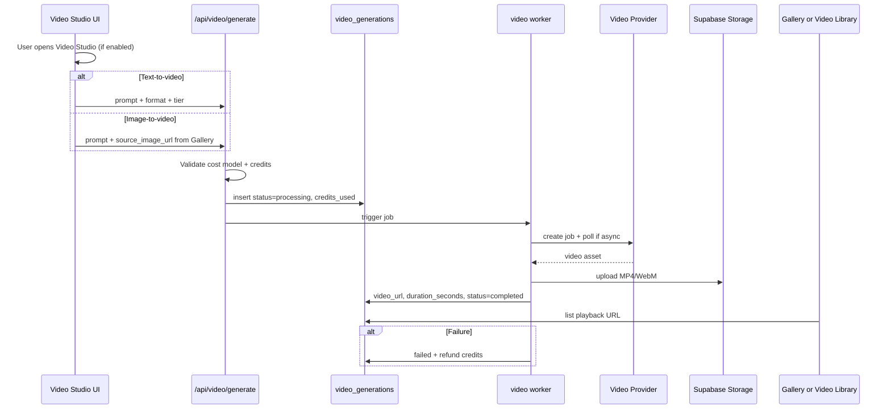

# InfluExAi — Video Studio Implementation Plan

**Document type:** Technical implementation specification  
**Audience:** Engineering, product, operations  
**Status:** Planning only — **no video provider activated**, **no code changes authorized by this document**  
**Last updated:** 2026-05-22  
**Related:** [CREDIT_AND_MODE_STRATEGY.md](./CREDIT_AND_MODE_STRATEGY.md), [ROADMAP_IMAGE_VIDEO_MODES.md](./ROADMAP_IMAGE_VIDEO_MODES.md)

This specification describes how **Video Studio** should be integrated for text-to-video and image-to-video workflows. It does not enable Video Studio in the MVP or production.

---

## 1. Goal

Video Studio shall later enable **text-to-video** and **image-to-video** pipelines for creator and brand campaigns.

| Objective | Detail |
|-----------|--------|
| Outputs | Short-form and campaign-length video clips stored in Supabase Storage |
| Inputs | Text prompt and/or existing Agent/Gallery still image |
| Positioning | Separate module from Standard Image; image generation remains unchanged |
| MVP | **Not live** — roadmap / Coming soon UI only |

---

## 2. Future provider candidates

Evaluate before any activation (quality, latency, COGS, ToS, synthetic-media policy).

| Candidate | Notes |
|-----------|--------|
| **Seedance** | Text-to-video / image-to-video candidate |
| **Kling** | Short-form and ad-style clips |
| **Other video providers** | Runway-class, regional hosts — shortlist at implementation |

| Rule | Requirement |
|------|-------------|
| **No activation in MVP** | No video API routes or env keys required for launch |
| **No UI Live badge** | Until backend, cost model, and production test pass |

Do not expose vendor names as Live product features until stable. Marketing label: **Video Studio**.

---

## 3. Use cases

| Use case | Description |
|----------|-------------|
| Text-to-video creator ads | Prompt → vertical/horizontal ad clip |
| Image-to-video from Agent | Animate completed `generations.image_url` |
| Product motion clips | Subtle product movement for ecommerce/social |
| Vertical short-form | Reels, TikTok, Stories aspect ratios |
| Social campaign variations | Multiple clips from one campaign brief |

---

## 4. Suggested credit model

| Tier | Credits | Notes |
|------|---------|--------|
| **Short clip** | **15–30** | e.g. ≤5–8 s, standard resolution |
| **Premium / longer clip** | **40–80** | longer duration, higher res, or premium provider tier |
| **Final pricing** | TBD | Lock only after provider cost test (COGS per second vs per clip) |

Billing unit must be decided before public UI: **per clip** (tiered) and/or **per second** with caps.

Credits must be **reserved or debited before** any provider call ([CREDIT_AND_MODE_STRATEGY.md](./CREDIT_AND_MODE_STRATEGY.md) §9).

---

## 5. Future flow

### Proposed API surface (later — names TBD)

| Step | Behavior |
|------|----------|
| Submit | `POST` video generation endpoint (new route family — **not** `/api/generate` image path) |
| Row | `workflow` / `mode`: `video_studio`; `provider`, `model`; `credits_used` per tier |
| Worker | Async provider job id → polling → upload → complete |
| Gallery | Extend list/detail to support `video_url` playback or dedicated Video Library view |

**Table name (proposed):** `video_generations` or extend `generations` with `video_url` — decide at schema design; this doc assumes explicit video metadata fields.

---

## 6. Future database fields

Required or strongly recommended when Video Studio ships:

| Field | Purpose |
|-------|---------|
| `video_url` | Output playback URL |
| `duration_seconds` | Billing, UI label, provider input |
| `source_image_url` | Image-to-video source (from Gallery/Agent) |
| `provider_job_id` | Poll/webhook correlation |
| `provider_latency_ms` | Ops and cost tuning |
| `mode` / `workflow` | `video_studio` |
| `credit_cost` / `credits_used` | Audit trail |
| `aspect_ratio` | e.g. `9:16`, `16:9`, `1:1` |
| `resolution` | e.g. `720p`, `1080p` |
| `parent_generation_id` | Link to source still image row |

Existing image columns (`provider`, `model`, `prompt`, `final_prompt`, `status`, `error_message`) may be shared or mirrored on a video-specific table.

---

## 7. Safety requirements

| Rule | Requirement |
|------|-------------|
| No video API without cost model | Documented tiers + COGS sign-off |
| Timeout handling | Max wall time; fail + refund |
| Provider job polling | Stale job cleanup; no infinite `processing` |
| Refund on failure | Full `credits_used` via existing refund RPC pattern |
| No duplicate processing | Idempotent worker on `status` |
| Storage upload required | No “completed” without verified `video_url` |
| Production test | End-to-end on Vercel before public activation |
| Standard Image isolation | Image worker path unchanged |
| User confirmation | Show **estimated credits** before submit |

---

## 8. UI requirements later

**Current state:** Video Studio module in dashboard/sidebar is **Coming soon / Planned** — not functional.

| Requirement | Detail |
|-------------|--------|
| Disabled until backend ready | No generate button that hits a provider |
| **Coming soon** badge | Clear non-Live status |
| Source image picker | Select from Gallery / Agent results (`image_url`) |
| Format selection | Vertical vs horizontal; aspect + resolution presets |
| Estimated credits | Display tier (15–30 vs 40–80) before confirmation |
| Processing status | Poll or subscribe to job status |
| Result | Inline player + download; Gallery/Video Library entry |

---

## 9. Test plan

| # | Test | Expected |
|---|------|----------|
| 1 | Local job creation | Row `processing`, correct `credits_used` |
| 2 | Production job creation | Worker secret + provider env on Vercel |
| 3 | Provider timeout | `failed` + refund |
| 4 | Failed provider | Error message safe; credits restored |
| 5 | Storage upload | `video_url` playable |
| 6 | Video playback | Desktop browser plays clip |
| 7 | Mobile playback | iOS/Android acceptable |
| 8 | Gallery metadata | Badge, duration, source thumb if image-to-video |
| 9 | Credit deduction | Balance matches tier |
| 10 | Retry behavior | No double charge on duplicate worker invoke |

---

## 10. Rollout plan

| Step | Scope | Deliverable |
|------|--------|-------------|
| **1** | Documentation only | This file (**current step**) |
| **2** | Backend prototype | Feature flag `VIDEO_STUDIO_ENABLED=false` |
| **3** | Manual internal testing | §9 checklist in staging |
| **4** | Admin-only UI | Internal users only |
| **5** | Limited release | Gradual rollout; monitor errors |
| **6** | Cost monitoring | COGS vs credits; tune 15–80 bands |

**Phase alignment:** Video Studio = **Phase 6** in [CREDIT_AND_MODE_STRATEGY.md](./CREDIT_AND_MODE_STRATEGY.md) §10.

**Prerequisites:** Stable image modes; storage policies for large video objects; CDN/bandwidth review.

---

## 11. Out of scope for Video Studio v1

- Lip Sync (separate spec: [LIP_SYNC_IMPLEMENTATION_PLAN.md](./LIP_SYNC_IMPLEMENTATION_PLAN.md))
- Cinema Agent orchestration ([CINEMA_AGENT_IMPLEMENTATION_PLAN.md](./CINEMA_AGENT_IMPLEMENTATION_PLAN.md))
- Live activation in MVP
- New npm packages without security review
- Changing Standard Image or Stripe packages

---

## Document maintenance

- Update provider shortlist and credit tiers when benchmarks complete.
- Cross-link PRs for video routes, storage, and dashboard Video module.

**Owner:** Platform engineering
